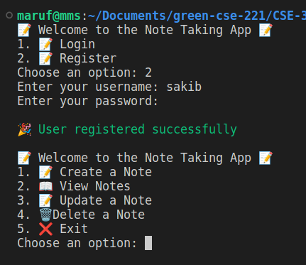
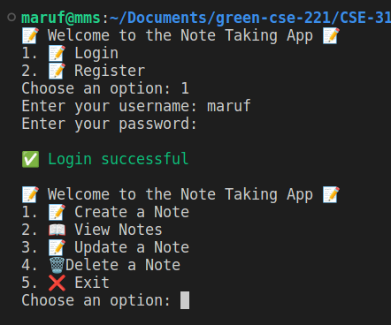

# CLI Based Note Taking App

Welcome to the CLI Based Note Taking App! This is a simple command-line interface application that allows users to create, view, update, and delete notes. It also supports user registration and login functionality.

## Features

- **User Registration and Login**: Securely register and login using a username and password.
- **Create Notes**: Easily create notes with a title and body.
- **View Notes**: View all notes or a specific note by title.
- **Update Notes**: Update the body of an existing note.
- **Delete Notes**: Delete a note by its title.

## Prerequisites

- **Bash**: Ensure you have a Unix-like environment with Bash installed.
- **jq**: This app uses `jq` for JSON parsing. You can install it using your package manager. For example, on Ubuntu, you can install it using:
  ```bash
  sudo apt-get install jq
  ```

## Installation

1. Clone the repository:

   ```bash
   git clone https://github.com/maruf-pfc/cli-based-note-taking-app.git
   cd cli-based-note-taking-app
   ```

2. Make the script executable:
   ```bash
   chmod +x main.sh
   ```

## Usage

1. Run the script:

   ```bash
   ./main.sh
   ```

2. Follow the on-screen instructions to register or login.

3. Use the main menu to create, view, update, or delete notes.

## Screenshots

Here are some screenshots demonstrating how to use the app:

1. Register a new user:

   

2. Login with the registered user:

   

3. Create a new note:

   

4. Read a note:

   

5. Read all notes:

   

6. Update a note:

   
   

7. Delete a note:

   
   

## Tools and Libraries

- **jq**: [jq](https://stedolan.github.io/jq/) is used for parsing JSON data.

## License

This project is licensed under the MIT License - see the [LICENSE](LICENSE) file for details.

## Contributing

Contributions are welcome! Please feel free to submit a Pull Request.
